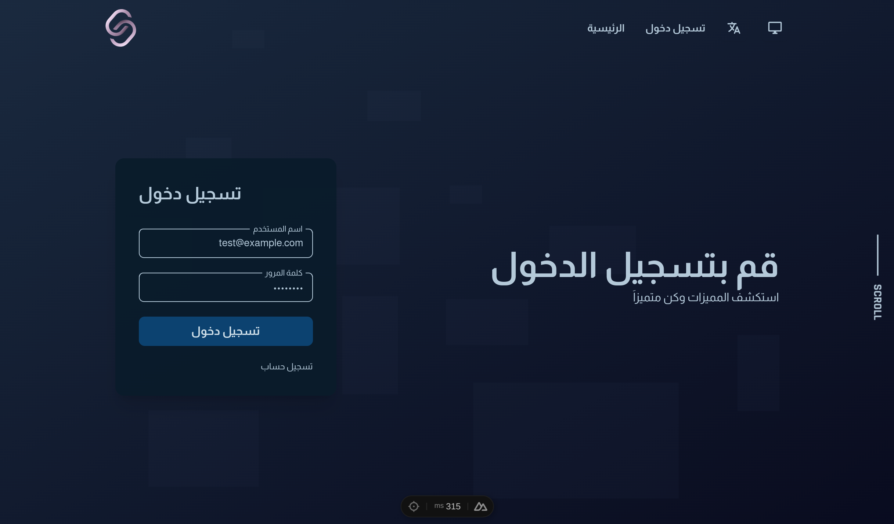
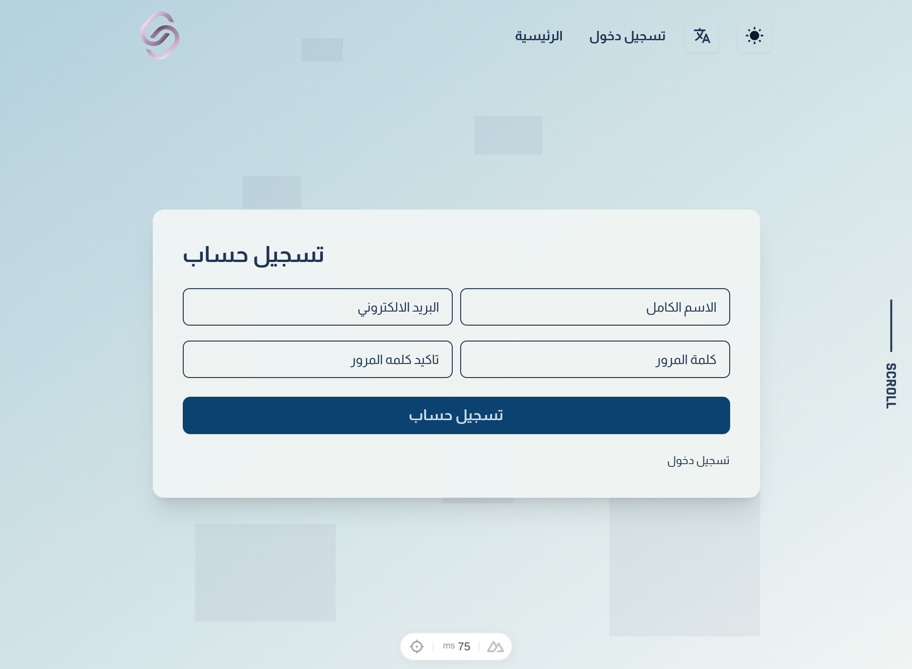
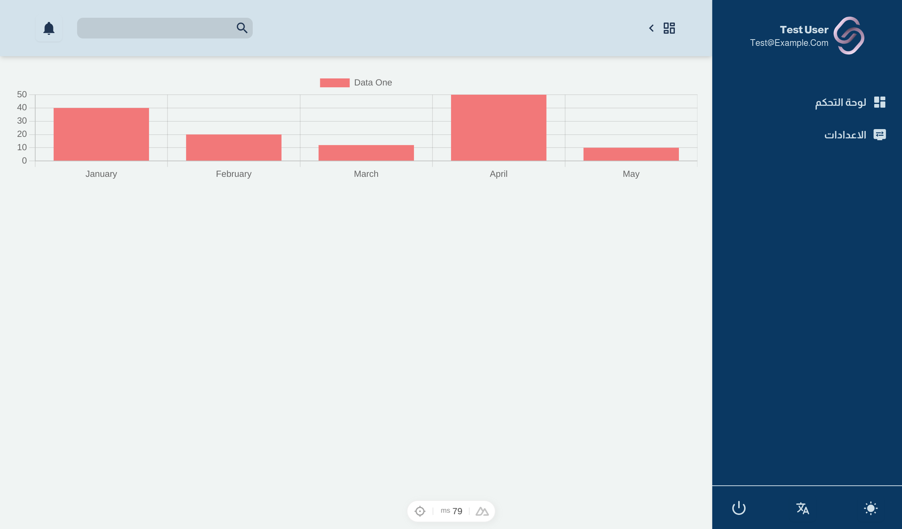

<p align="center"></p>

<p align="center">
    <a href="https://choosealicense.com/licenses/mit/"></a>
    <a href="#"></a>
    <a href="#"></a>
    <a href="#"></a>
</p>

# Starter Kit for Laravel and Nuxt3

An Open Source Project designed to provide our fellow developers/students a better way to get started.

## Content

| Project   | Type          | Description                     |
| :-------- | :------------ | :------------------------------ |
| `api.app` | `Laravel 11`  | **Required**. PHP ^8.2          |
| `app`     | `Nuxt 3`      | **Required**. Node ^v20.14      |

## Features

- api.app

  - [ ] Laravel breeze api
  - [ ] Http response helper
  - [ ] Activity log helper
  - [ ] Collection manager helper
  - [ ] Htaccess firewall

- app

  - [ ] Tailwind CSS
  - [ ] Responsive design
  - [ ] Light/dark mode component
  - [ ] Multilingual component
  - [ ] Auth pages
  - [ ] Dashboard
  - [ ] Toast notification

<!--
## Theme Color Reference

| Color             |                                                          | Hex     |
| :---------------- | :-------------------------------------------------------:| :-------|
| Dark theme:       |                                                          |         |
| Primary           |  | #b4c9d9 |
| Secondary         |  | #0b4b7d |
| Background        |  | #090b1f |
| Light theme:      |                                                          |         |
| Primary           |  | #203552 |
| Secondary         |  | #0b4b7d |
| Background        |  | #f0f4f3 |

## Screenshots

<p align="center">




</p>
-->

## Setup And Run

Test the app by run the following command:

```bash
  # API
  composer install --working-dir=./api.app
  php ./api.app/artisan migrate
  php ./api.app/artisan db:seed
  php ./api.app/artisan serve

  # WEB
  yarn --cwd ./app install
  yarn --cwd ./app run dev
```

## Feedback

If you have any feedback, please reach out to us at sumer5020@outlook.com