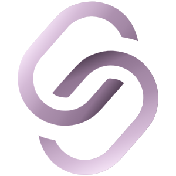

    
    
    
    

# Starter Kit for Laravel and Nuxt3

An Open Source Project designed to provide our fellow developers/students a better way to get started.

## Content

| Project   | Type          | Description                     |
| :-------- | :------------ | :------------------------------ |
| `api.app` | `Laravel 11`  | **Required**. PHP ^8.2          |
| `app`     | `Nuxt 3`      | **Required**. Node ^v20.14      |

## Features
- api.app

  - [ ] Laravel breeze api
  - [ ] Http response helper
  - [ ] Activity log helper
  - [ ] Collection manager helper
  - [ ] Htaccess firewall
 

- app

  - [ ] Tailwind CSS
  - [ ] Responsive design
  - [ ] Light/dark mode component
  - [ ] Multilingual component
  - [ ] Auth pages
  - [ ] Dashboard
  - [ ] Toast notification
